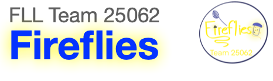
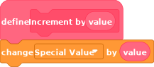
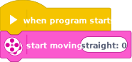
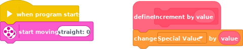

<center></center>
---

# LEGO EV3 Classroom Project Tool
The LMSP tool is a simple command line tool that copies selected stacks from one [LEGO EV3 Classroom](https://education.lego.com/en-us/downloads/mindstorms-ev3/software) project file `*.lmsp` to another. 

## Why this tool
The LEGO EV3 Classroom is a nice entry level programing environment for LEGO EV3 robots. It combines ease of use of the [Scratch](https://scratch.mit.edu) language with an integrated environment that allows one to build and run programs on the EV3. It requires almost no effort to setup.

However, as programs get more complicated, the user quickly discovers one big limitation:

<div style="color: red; text-align: center; font-size: 1.5em; border: solid 1px red">
    There is no way to copy blocks between different projects using the UI
</div> 

For people involved in [First Lego League (FLL)](https://www.firstlegoleague.org) competitions, there are 2 use cases that are extremely painful because of that:

* Case 1: A library of common My Blocks for the team
* Case 2: Building a single final program from multiple individual programs

This tool was designed to ease that pain.

## What this tool does  

The primary purpose of the tool is to copy stacks of blocks from one program to another. It also copies all used My Blocks and creates all required variables, lists and broadcasts. If My Block with the same call signature already exists in the target file, it gets replaced with the one form the source.

### Source Project
For this example, we will use a file `source.lmsp` that contains a simple My Block `Increment by` definition that uses a custom variable `Special Value`. This file will serves **"a source for a My Block"**.

Inside every `lmsp` file there is an SVG file with depiction of the project content. This SVG is probably used by the EV3 Classroom software for showing project preview. We can extract this file from the project using the tool:

```shell
$ lmsp svg source.lmsp > source.svg
``` 

The resulting SVG will look like:



We can also use the tool to list the content of the project to see what can be copied:

```
$ lmsp list source.lmsp

Stacks in file source.lmsp

--------------------------------------------------------------------------------

[1] procedure Increment by %s

   [procedures_definition]
   [data_changevariableby]

   uses variable   "Special Value" (1)

--------------------------------------------------------------------------------
```

### Target Project
For this example, we will use a simple project stored in `target.lmsp` file. We will copy a My Block from the source project and merge it with the content of the destination project to produce an output:




### Copy from the Source to the Target

To copy MyBlock definition (stack 1) from the `source.lmsp` to the content of `target.lmsp` and save the result in `output.lmsp` destination we can run the following command:

```
$ lmsp copy source.lmsp target.lmsp output.lmsp 1

Copy stacks from source.lmsp to target.lmsp :

    [1] procedure Increment by %s

Perform project merge:

    COPY       variable   Special Value
    COPY       procedure  Increment by %s

Save output -->  output.lmsp
```

Notes: 

- The output file and the target file can be the same.
- We can use My Block signature "Increment by %s" instead of index 1
- We can specify multiple source stacks

The resulting project looks like:



Because the My Block used a custom variable, that variable is copied as well.

## How To Install and Run
This tool is a NodeJS package, she the installation of relatively recent version of [NodeJS](https://nodejs.org) is required.

At present, the author does not provide any packaged version of the tool, so to run the tool one needs to download source code from the GitHub.


After that you can install package dependancies. The instructions that follows will use [Yarn](https://yarnpkg.com) package manager, but the standard NPM that comes with NodeJS can be used as well. Go to the root directory of the package source and run the following command:

```
$ yarn  
```

Now you can use NodeJS interpreter to run the `cli.mjs` file:

```
$ node cli.mjs list example/source.lmsp
```

To run the same command from other directories, you will need to specify a path to the scripts. For example, to run it from `example/` directory:

```
$ cd example
$ node ../cli.mjs list source.lmsp
```

You can also create a global link to run the tool from any place in the system without specifying script path:

```
$ yarn link
```

Now you can run the same command as:


```
$ lmsp list example/source.lmsp
$ cd example
$ lmsp list source.lmsp
```

To remove globally installed tool run:

```
$ yarn link
```

## Disclaimer
This software is shared as is. It was created for and got a very limited testing on a real project done by FLL Team 25062 "Fireflies" for the season of 2022-23.

There may be some bugs and limitations. Source code and tool documentation may be considered as lacking. 

## References

- [Official Lego EV3 Classroom software download page](https://education.lego.com/en-us/downloads/mindstorms-ev3/software)
- [Information about LMSP file format](https://fileinfo.com/extension/lmsp)
- [Information about Scratch file format](https://www.en.scratch-wiki.info/wiki/Scratch_File_Format)